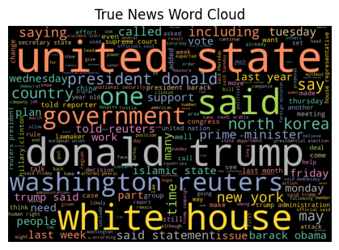

## Final Project
# Fake News Classification
#### Sofia Huang | DATA 441 - Adv. Applied Machine Learning

### 1. Introduction
Although it can have many nuanced definitions, fake news can generally be understood as a false narrative published as if it were true. Before social media, fake news was more like propaganda promoted by leaders to create a widespread specific point of view or belief. Nowadays, it is much easier to spread information, both true and false. 
Fake news and its detection has received quite a bit of attention recently, and for good reason. With humans consuming social media and news every single day, it is easy to fall victim to false information and this has dire consequences. It can change a person’s attitudes and perceptions towards different subjects and therefore change their actions and behaviors. In other words fake news and their creators have the potential to control people and have them act based on their own agenda. A prime example of this is the spread of fake news swaying political elections.
The problem at hand is the spread of fake news and the impossibility of manually verifying every post and news article that gets published. Machine learning is the obvious answer for this, with vast amounts of data and various ML classification techniques, there must be a way to create a model that can flag new articles and posts as real or fake. 

### 2. Related Works
There have been many studies done regarding fake news detection using machine learning, especially since the 2016 election and the pandemic. Various different machine learning models are used in these studies but a clear best choice has not been defined. [5] noted that many studies use Naive Bayes to classify news. This is interesting since it is not common for Naive Bayes to outperform other models for news classification when compared with others but it is still a popular choice. They also found that their boosted model performed the best. [3] compared 3 different vectorizers with 5 different models and found that the “word2vec” vectorizer performed the worst and found that support vector machines and logistic regression were better choices than a neural network due to the risk of overfitting onto the dataset. [9] also produced some statistics about their data that showed the fake news contained more adjectives and adverbs while the real news continued more pronouns. From this, it is assumed that the fake news relied on eye-catching headlines and exaggerated stories, while real news focused on credibility. [10] also found that the “word2vec” technique did not perform well and did not recommend it. [12] used stance detection rather than the conventional binary classification to detect fake news. They tried to predict the stance of a news article based on the relationship between its headline and the content. More extreme stances (very positive or very negative) and headlines using “clickbait” language are more likely to be fake, rather than a neutral headline that is not trying to sway anyone’s opinion but be informative. 

### 3. Data
The dataset I am using is available on Kaggle. It contains 72,134 news articles with 35,028 real and 37,106 fake news. The subject of the news in the data is mostly U.S. politics. The creators merged four popular news datasets (i.e. Kaggle, McIntire, Reuters, BuzzFeed Political) to “prevent overfitting of classifiers and to provide more text data for better ML training.” The dataset contains four columns: Serial number (starting from 0); Title (about the text news heading); Text (about the news content); and Label (0 = fake and 1 = real).

### 4. Methodology

_4.1 Preprocessing_

First, I removed any columns I did not need, such as the serial number. Then I looked to see if there were any missing values and removed those as well. I also combined the article title and the article text into one column so they can be used together for classification. Then, I randomly shuffled the dataset to make sure the traning/testing sets have similar distributions that are representative of the whole data. 
Next, I preprocessed the contents of the dataset. I focused on the article text column. So, to prepare it for classification I had to remove all of the punctuation, URLs, numbers, and any other unnecessary characters so that all that is left are the letters from “a” through “z”. I did this using the Regular Expressions function, “sub”.
In the English language there are many frequently used words that do not contribute to the meaning of the text, such as, “a”, “the”, “and”, “is“, etc. I removed these from the text using NLTK’s list of stopwords, so the models can focus on the significant words in the text and improve its performance. Finally, I used NLTK’s PorterStemmer to normalize the text. The algorithm simplifies words by converting them to their roots. For example, the words “argue”, “argues”, “argued”, and “arguing” would all be converted to the root “argu”. After this step, I had clean and preprocessed data that can be used by the classification models.

_4.2 Visualizations_

Before training any machine learning models, I wanted to take a look at the data and see the differences between the true and fake news. I did this by creating Word Clouds for both the true and fake news texts. A Word Cloud is a data visualization technique where the size of the word represents its frequency within the dataset. Based on the results, we can see that the fake news had more emphasis on Donald Trump while the real news covered both Donald Trump and Hillary Clinton pretty evenly. We can also deduce that the news in this dataset is mostly from around the 2016 presidential elections and mostly pertains to US politics. 

       

I also wanted to create a bar chart to show the top 20 most frequent words and bigrams for both true and fake news articles. Looking at the charts below, we can see that the fake news contained many more instances of “donald trump” than “hillary clinton”, while the true news had a much smaller difference of the two bigrams. The fake news also contained more attention-grabbing and controversial bigrams, such as “north korea” and “islamic state”. While the real news contained bigrams that relate to the credibility and the source of the news, like “image via”, “getty images”, and “fox news”. 

       

_4.3 Vectorization_

A popular vectorizing technique for text mining is TF-IDF which stands for “Term Frequency - Inverse Document Frequency”. This technique gives weights to the words in a document based on how common they are within the whole corpus, thus determining how significant they are. This gives more information compared to CountVectorizer which simply gets the word count of each word within a document. The vectorizing part refers to converting the text into a numerical representation. In this case, the words are converted into their TF-IDF scores.

For the deep learning LSTM model, I used one hot encoding instead of the TF-IDF vectorizer. This improved the results for the LSTM model significantly. One hot encoding is a technique to create vectors for each word in a vocabulary. Although it does not convey word relationships and significance like TF-IDF does.

| Vocabulary → | CAT | DOG |  ON | THE |
|--------------|-----|-----|-----|-----|
|“CAT” vector →|  1  |  0  |  0  |  0  |
|“THE” vector →|  0  |  0  |  0  |  1  |
|“DOG” vector →|  0  |  1  |  0  |  0  |

_4.4 Classification Models_

Logistic Regression

A supervised machine learning algorithm that can be used to model the likelihood that the target variable is a certain class. In this case, either 0(Fake) or 1(True). The logistic or sigmoid function is used to predict the probability that the input variable is in a certain class.

Naive Bayes

Uses Bayes Theorem, which is used to calculate the probability of an event happening given the probability that another event has already occurred. It is “naive” because the model assumes all of the input variables are independent of each other. 

Gradient Boosted

This algorithm sequentially builds models that correct the errors of the previous ones. The additive models are trained on the errors of the previous one. So, multiple “weak learners” are added together to create a stronger learner. The strong learner is an ensemble of decision trees. The loss function that is trying to be minimized in the case of classification is the log-likelihood function. There are a lot of hyperparameters to be tuned to reach an effective model which can result in a time-consuming and resource-intensive grid search. However, this model is also prone to overfitting so using regularization techniques are important to prevent this. 

Support Vector Machines

A support vector machine is a supervised learning algorithm. It is based on the idea of finding a hyperplane that best divides the dataset. Support vectors are the data points closest to the hyperplane and if removed would cause the best hyperplane to change, in other words they are critical points. The margins are the distances between the hyperplane and the closest data point from both classes. The goal is to choose a hyperplane with the greatest margins using training set data. In most cases, the data will not be able to be cleanly split using a line, in other words, not linearly separable. So, we map the data points into a higher dimension (ie. 2D to 3D, aka. kernelling) and now the hyperplane is a plane rather than a line. The data continues to get mapped into higher and higher dimensions until a hyperplane can be formed to separate the data points into the correct classes. 
	
LSTM

LSTM stands for Long Short-Term Memory and is a sequential deep learning technique. It is a type of recurrent neural network or RNN that can learn long-term dependencies and retain long-term information unlike regular RNNs. They are capable of remembering previous information and using it to process current input. Its structure consists of three gates: forget gate, input gate, and output gate. In the forget gate, the neural network determines what information is useful and to be kept, while unnecessary information is discarded or “forgotten”. In the input gate, the neural network quantifies the importance of the new input information. The output gate lets the result of the current task at hand through by using the information stored previously. This type of neural network is popular in NLP problems as it can take into account the sequential nature of words in text. 

### 5. Results
The data was randomly shuffled and split into training and testing sets with the testing set being 25% of the data. I used GridSearchCV to tune the hyperparameters of the traditional machine learning models. I had to manually test the LSTM network due to my machine’s limits. This led me to change the word embedding technique used for LSTM from TF-IDF vectorization to one hot encoding as this significantly increased the results. The final models that I tested and their optimal hyper parameters are below: 

LogisticRegression(C=100, max_iter=100000)

MultinomialNB(alpha=0.001)

GradientBoostingClassifier(learning_rate=0.2, max_depth=8, n_estimators=50)

SVC(C=1, degree=1, gamma=1, kernel=’poly’)

LSTM:
 

I then performed k-fold cross validation using each of the optimal models to find the cross validated weighted average F1 score and the accuracy. F1 score is a common metric used for binary classification evaluation and is calculated using precision and recall.

$ F1 = {2 {precision * recall \over precision + recall} = {2tp \over 2tp + fp + fn}} $, where tp = true positives, fp = false positives, fn = false negatives.

I obtained the results using sklearn’s classification report. The results are shown in the table below. 

| Model  | Logistic Regression | Naive Bayes |  Gradient Boosted | SVM    | LSTM  |
|--------|---------------------|-------------|-------------------|--------|-------|
|Weighted Avg F1 Score     | 0.9320|0.8727|0.9326|0.9845|**0.9342**|
|Accuracy|0.9320|0.8727|0.9327|0.9845|**0.9342**|

The confusion matrices for all classifiers are shown below.

------------------ Logistic Regression ---------------- 

 

---------------- Multinomial Naive Bayes --------------

 

------------ Gradient Boosted Classifier --------------

 

------------- Support Vector Machine ------------------ 

 

------------------------ LSTM ---------------------------

We can see that the LSTM network definitely performed the best with the highest accuracy and F1 score out of the classifiers tested. Naive Bayes had the worst performance. Logistic Regression, Naive Bayes, and Support Vector all had similar and decent accuracy scores around 0.93.

### 6. Conclusion
The purpose of this research was to experiment and find the best performing model for fake news detection and classification in hopes of creating a system that can take all articles and social media posts as input and flag those that are classified as fake so that they can be manually checked. It was found that all of the models were capable of accurately classifying the news, with the LSTM network outperforming the traditional machine learning models. The models were able to detect patterns within the words used in the articles to classify them as fake or not. So, comparing the facts is not necessarily required in order to determine the legitimacy of an article. Instead, the word patterns can be used by machine learning. 

A deep learning approach would be a good start to implement a system of fake news flagging in the future to reduce the spread of misinformation around the internet and social media. The goal is to implement an algorithm with the ability of detecting fake news across all corners of the internet. Future work plans include testing additional deep learning models with the use of more computational power. As well as, expanding the data from just U.S. politics news articles to news of different subjects and from different countries. Also, not just limiting the data to news articles but also include social media posts such as tweets from Twitter and Instagram and Facebook posts would be a step in the right direction to reach the end goal. 

### 7. References
[1] Brownlee, J. (2020, August 14). Logistic regression for machine learning. MachineLearningMastery.com. Retrieved April 29, 2023, from https://machinelearningmastery.com/logistic-regression-for-machine-learning/ 

[2] Guiding Tech Media. (n.d.). Support Vector Machines: A simple explanation. KDnuggets. Retrieved May 6, 2023, from https://www.kdnuggets.com/2016/07/support-vector-machines-simple-explanation.html 

[3 Gupta, S. (n.d.). Word vector encoding in NLP (make machines understand text). enjoyalgorithms. Retrieved May 2, 2023, from https://www.enjoyalgorithms.com/blog/word-vector-encoding-in-nlp 

[4] Huang, J. (2020). Detecting fake news with machine learning. Journal of Physics: Conference Series, 1693(1), 012158. https://doi.org/10.1088/1742-6596/1693/1/012158 

[5] Khanam, Z., Alwasel, B. N., Sirafi, H., & Rashid, M. (2021). Fake news detection using machine learning approaches. IOP Conference Series: Materials Science and Engineering, 1099(1), 012040. https://doi.org/10.1088/1757-899x/1099/1/012040 

[6] Kurama, V. (2021, April 9). Gradient boosting for classification. Paperspace Blog. Retrieved April 29, 2023, from https://blog.paperspace.com/gradient-boosting-for-classification/ 

[7] Long short-term memory networks (LSTM)- simply explained! Data Basecamp. (2023, April 6). Retrieved April 29, 2023, from https://databasecamp.de/en/ml/lstms 

[8] Ray, S. (2023, April 26). Naive Bayes classifier explained: Applications and practice problems of naive Bayes classifier. Analytics Vidhya. Retrieved April 29, 2023, from https://www.analyticsvidhya.com/blog/2017/09/naive-bayes-explained/#How_Do_Naive_Bayes_Algorithms_Work? 

[9] Sairamvinay Vijayaraghavan, Ye Wang, Zhiyuan Guo, John Voong, Wenda Xu, Armand Nasseri, Jiaru Cai, Linda Li, Kevin Vuong, & Eshan Wadhwa. (2020). Fake News Detection with Different Models.

[10] Shubha Mishra, Piyush Shukla, Ratish Agarwal, "Analyzing Machine Learning Enabled Fake News Detection Techniques for Diversified Datasets", Wireless Communications and Mobile Computing, vol. 2022, Article ID 1575365, 18 pages, 2022. https://doi.org/10.1155/2022/1575365

[11] Srivastava, T. (2023, April 26). A complete guide to K-Nearest Neighbors (updated 2023). Analytics Vidhya. Retrieved April 29, 2023, from https://www.analyticsvidhya.com/blog/2018/03/introduction-k-neighbours-algorithm-clustering/ 

[12] Thota, Aswini; Tilak, Priyanka; Ahluwalia, Simrat; and Lohia, Nibrat (2018) "Fake News Detection: A Deep Learning Approach," SMU Data Science Review: Vol. 1: No. 3, Article 10.
Available at: https://scholar.smu.edu/datasciencereview/vol1/iss3/10

[13] Verma, P. K., Agrawal, P., Prodan, R., Verma, P. K., Agrawal, P., & Prodan, R. (2021, February 25). Welfake dataset for fake news detection in text data. Zenodo. Retrieved April 29, 2023, from https://zenodo.org/record/4561253#.ZE1KWOzMLAJ 

The full Python notebook is linked here: [Final Project Python Notebook](https://colab.research.google.com/drive/1rJWRBh7u3xKdshzOyvnt9WAv2RMZdVwQ#scrollTo=sD_Lz2ACx3VO)

[Back to Project Index](https://sofia-huang.github.io/DATA441/)
