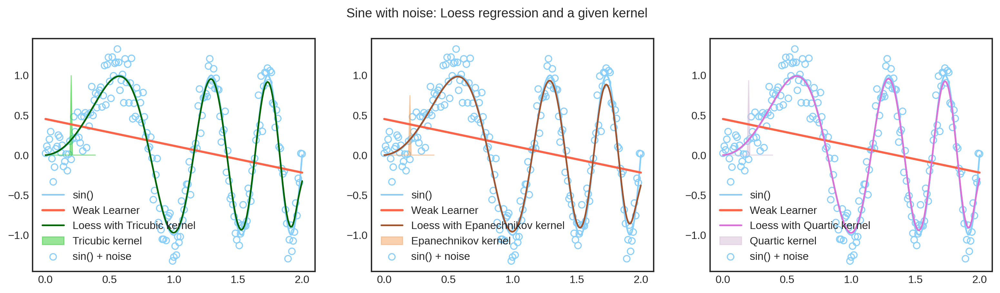
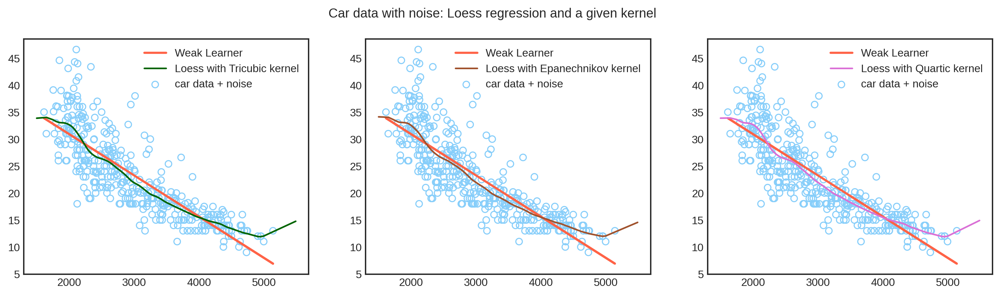
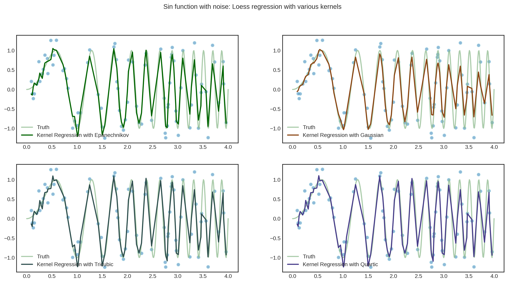
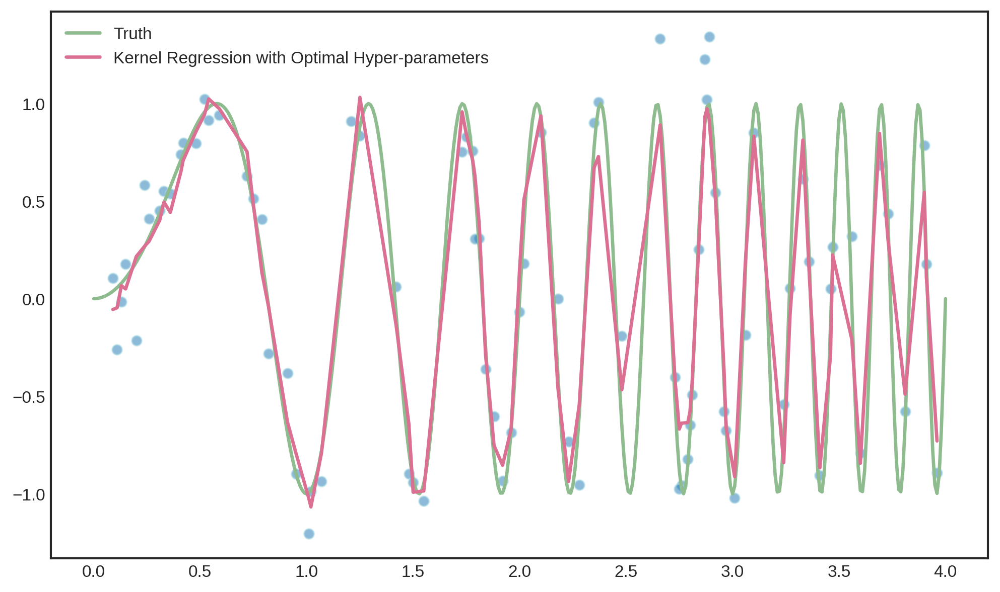

## Project 1 
# Introduction to Locally Weighted Regression

In this page, I will explain my understanding of locally weighted regression or LOWESS. However first, we must define the preliminaries. 

***Regression***: A technique used to train an algorithm to understand the relationship between independent variables (input features) and a continuous dependent variable (output). The errors in measurement or "noise" are assumed to be normally distributed with a mean of 0 and some unknown standard deviation. We want to use the trained algorithm to predict the expected value of the output as a function of the input features. 

***Linear regression***: One of the basic types of regression technique which plots a straight line of best fit within data points to minimise error between the line and the data points. It is assumed that the relationship between independent and dependent variables is linear when this technique is used. 

When there are multiple independent variables, this is called multiple linear regression and the idea is as follows: 

  * _Predicted Value = weight<sub>1</sub> * Feature<sub>1</sub> + weight<sub>2</sub> * Feature<sub>2</sub> + ... + weight<sub>p</sub> * Feature<sub>p</sub>_

The algorithm learns the optimal weights or coefficients of the input features as an iterative process, usually through a method such as gradient descent. 

Now that we know the foundation, how does an algorithm make predictions when the relationship between the independent and dependent variables are ***non-linear***? We use locally weighted regression (LOWESS).

***Locally weighted regression***: A technique that modifies the linear regression to make it fit non-linear functions. The non-parametric algorithm fits a linear model to localized subsets of the data to build a function that describes the variation in the data, point by point. Basically, there are many small local functions rather than one global function. The weights (parameters) of each training data point are computed locally (for each query data point) based on the distance of the training points from the query point, using a kernel function. This makes minimizing the errors easier and means the parameters are unique to each data point (instead of fitting a fixed set of parameters to the data). 

We use LOWESS when the distribution of data is non-linear and the number of features is smaller, as the process is highly exhaustive and computationally expensive. It also requires a large/dense dataset to produce good results since LOWESS relies on the local data structure when fitting the model.

# Python Code and Visualizations of Locally Weighted Regression

Below is the code for a basic LOWESS regression function.

```Python
# after inserting the proper libraries...
def kernel_function(xi,x0,kern, tau): 
    return kern((xi - x0)/(2*tau))

def weights_matrix(x,kern,tau):
  n = len(x)
  return np.array([kernel_function(x,x[i],kern,tau) for i in range(n)]) 

def lowess(x, y, kern, tau=0.05):
    # tau is called bandwidth K((x-x[i])/(2*tau))
    # tau is a hyper-parameter
    n = len(x)
    yest = np.zeros(n)
    
    #Initializing all weights from the bell shape kernel function       
    #Looping through all x-points
    
    w = weights_matrix(x,kern,tau)    
    
    #Looping through all x-points and fitting the local regression model
    for i in range(n):
        weights = w[:, i]
        lm.fit(np.diag(w[:,i]).dot(x.reshape(-1,1)),np.diag(w[:,i]).dot(y.reshape(-1,1)))
        yest[i] = lm.predict(x[i].reshape(-1,1)) 

    return yest
```
Here are some various kernels we can use.
```Python
# Tricubic Kernel
def tricubic(x):
  return np.where(np.abs(x)>1,0,(1-np.abs(x)**3)**3)   
  
# Epanechnikov Kernel
def Epanechnikov(x):
  return np.where(np.abs(x)>1,0,3/4*(1-np.abs(x)**2)) 
  
# Quartic Kernel
def Quartic(x):
  return np.where(np.abs(x)>1,0,15/16*(1-np.abs(x)**2)**2) 
```
Next, I created noisy, non linear data and ran the LOWESS function on it, using different kernels. I also ran a weak, linear regression model on the data to show the difference between LOWESS and linear regression on non linear data.

```Python
x = np.linspace(0,2,201)
noise = np.random.normal(loc = 0, scale = .2, size = len(x))
y = np.sin(x**2 * 1.5 * np.pi ) 
y_noise = y + noise
kernel = tricubic
kernel2 = Epanechnikov
kernel3 = Quartic
lm = LinearRegression()
# run lowess with different kernels
yest = lowess(x,y,kernel,0.04)
yest2 = lowess(x,y,kernel2,0.04)
yest3 = lowess(x,y,kernel3,0.04)

# Creating a weak learner using linear regression on nonlinear data
xlr = x.reshape(-1,1)
y_noiselr = y_noise.reshape(-1,1)
lr = LinearRegression()
lr.fit(xlr,y_noiselr)
yhat_lr = lr.predict(xlr)
```
Here is the result. I used Matplotlib to create this graph. Clearly, we cannot use linear regression on data like this and we must use something like locally weighted regression instead. In this example, we can't see much difference between the various kernels, but perhaps that's not a bad thing, it seems that any one we choose will give us good results. 

 

 

 

 

