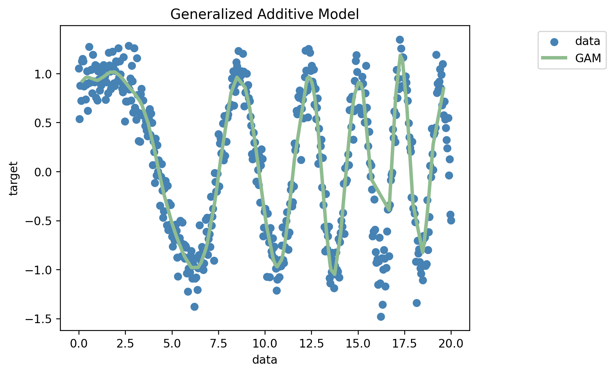
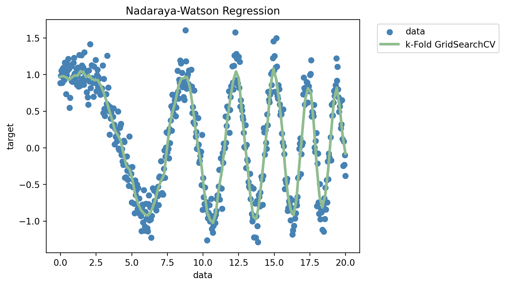

## Project 4
# Generalized Additive Model vs Nadaraya-Watson regressor
#### Goal: Generate 1-D (input) data and simulate a noised output of a rapidly oscillating function on the interval [0,20]; you will fit both regressors on a train set and measure their error on a test set. Show a plot comparing the two reconstructions of the gound truth function. Also, you will compare the 10-fold cross validated root mean square error of the two regressors on the "concrete.csv" data set.


First, I created the 1-D data to simulate a noisy output of a rapidly oscillating function. I also created train and test sets from the function.
```Python
x = np.linspace(0,20,500)
y = np.cos((x**2)/12) + np.random.normal(0, 0.2, len(x))

xtrain, xtest, ytrain, ytest = tts(x,y,test_size=0.2,shuffle=True,random_state=123)

xtrain = xtrain.reshape((-1,1))
xtest = xtest.reshape((-1,1))
ytrain = ytrain.reshape((-1,1))
```
Then, I fit the GAM on the training sets and used it to predict on the testing sets. 
```Python
gam = LinearGAM(n_splines=25).gridsearch(xtrain, ytrain)
yhat = gam.predict(xtest)
mse(ytest,yhat)
```
The mean squared error using GAM on the noisy cosine function data was **0.031180041893866403.**

I plotted the GAM's predictions against the true function and the result is below.

 

Using the same noisy cosine function input data and training and testing sets, I fit a Nadyara-Watson regressor and the MSE was **0.0609723802457237.** The code I used is below.
```Python
param_grid=[dict(kernel=['polynomial'], degree=np.arange(1, 5)),dict(kernel=['rbf'], gamma=np.logspace(-5, 5, 100))]
nw_gs = GridSearchCV(NadarayaWatson(), cv=10, param_grid=param_grid)
nw_gs.fit(xtrain, ytrain)
y_gs = nw_gs.predict(xtest)
mse(ytest,y_gs)
```
Then, I plotted the predictions with the true function and here is the result. 
 

The Generalized Additive Model slightly outperformed the Nadaraya-Watson regressor when using the same data. However, the difference in MSE is less than 0.02. Both models had low MSEs and as seen in the plots, were able to predict the noisy cosine function well.

## K-Fold Cross Validations on the concrete.csv dataset
I performed K-fold cross validations for both models using the concrete.csv dataset. 

```Python
kf = KFold(n_splits=10,shuffle=True,random_state=1234)
mse_gam = []
model = LinearGAM(n_splines=6).gridsearch(x_train, y_train)

for idxtrain, idxtest in kf.split(x_cc):

  x_train = x_cc[idxtrain]
  y_train = y_cc[idxtrain]
  y_test = y_cc[idxtest]
  x_test = x_cc[idxtest]

  model.fit(x_train,y_train)
  yhat = model.predict(x_test)

  mse_gam.append(mse(y_test,yhat))
  print(mse(y_test,yhat))

print('The Cross-validated Mean Squared Error for GAM is : '+str(np.mean(mse_gam)))
```
**The Cross-validated Mean Squared Error for GAM is : 37.95743639775138**
```Python
kf = KFold(n_splits=10,shuffle=True,random_state=1234)
mse_nw = []
model = GridSearchCV(NadarayaWatson(), cv=10, param_grid=param_grid)

for idxtrain, idxtest in kf.split(x_cc):

  x_train = x_cc[idxtrain]
  y_train = y_cc[idxtrain]
  y_test = y_cc[idxtest]
  x_test = x_cc[idxtest]

  model.fit(x_train,y_train)
  yhat = model.predict(x_test)

  mse_nw.append(mse(y_test,yhat))
  print(mse(y_test,yhat))

print('The Cross-validated Mean Squared Error for Nadaraya-Watson is : '+str(np.mean(mse_nw)))
```
**The Cross-validated Mean Squared Error for Nadaraya-Watson is : 63.476314340632015**
